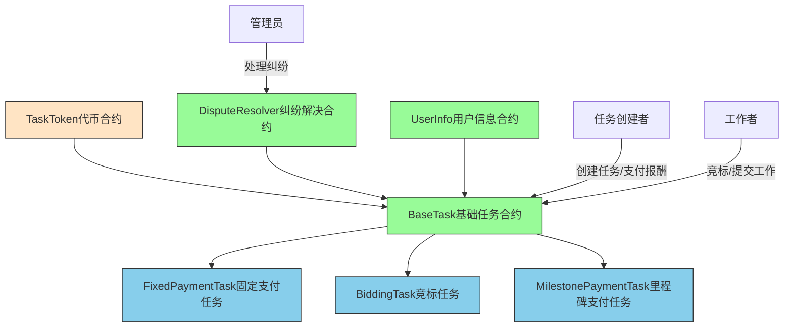
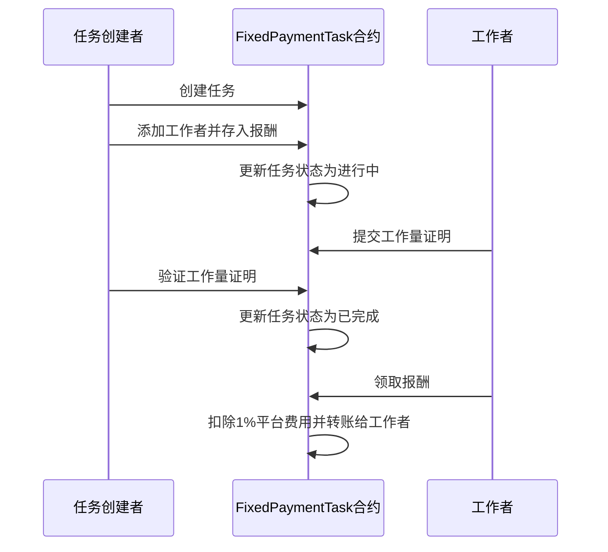
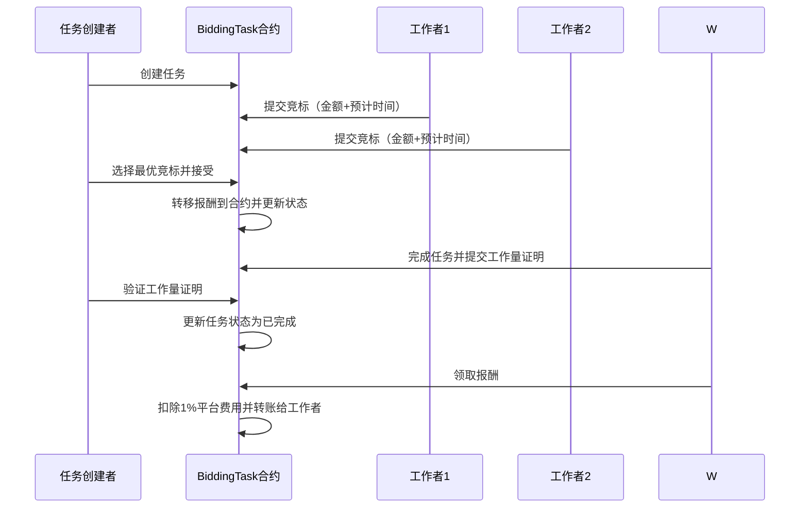
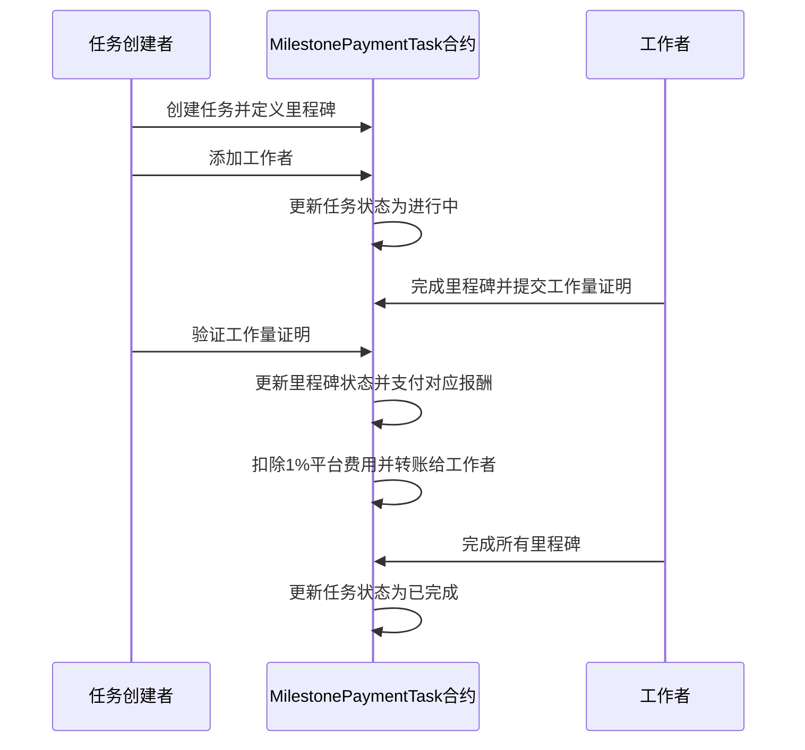
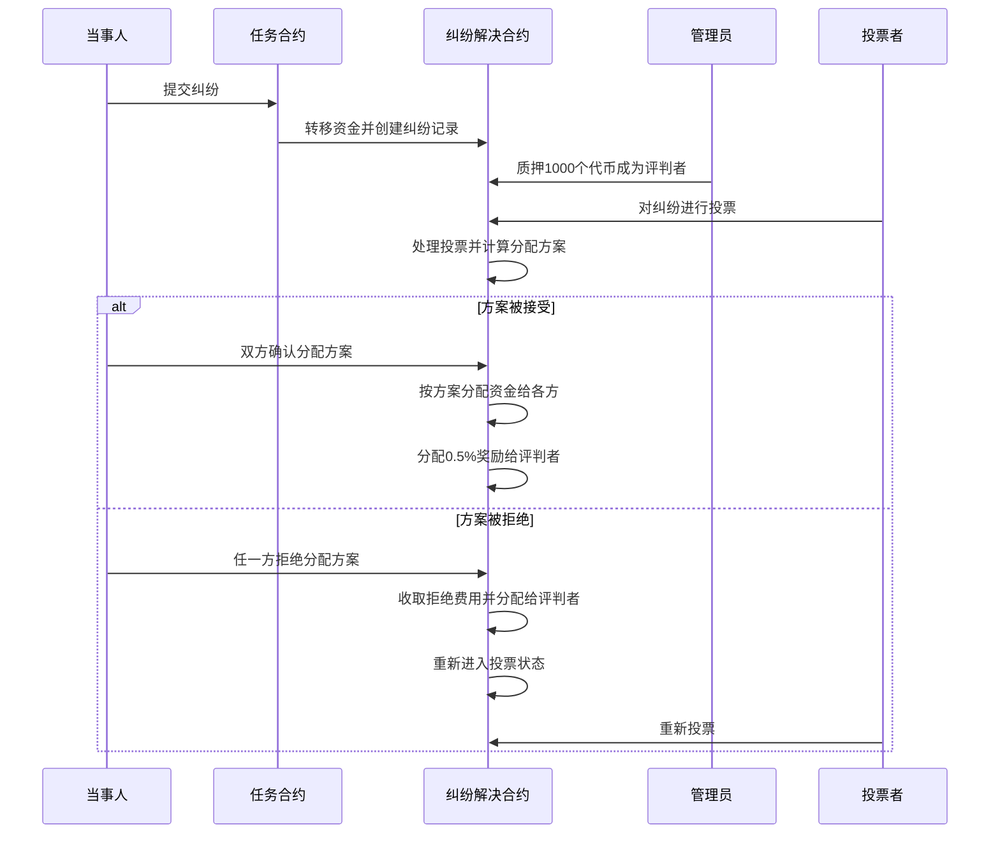

# 众包任务合约系统

## 简介

本项目是一套基于以太坊的智能合约系统，用于管理众包任务。系统支持多种任务类型和支付方式，提供纠纷解决机制，确保任务创建者和工作者之间的公平交易。

本项目基于 Scaffold-ETH 2 构建，是一个开源、最新的工具包，用于在以太坊区块链上构建去中心化应用程序（dapps）。它旨在让开发人员更容易创建和部署智能合约，并构建与这些合约交互的用户界面。

⚙️ 技术栈：NextJS、RainbowKit、Foundry、Wagmi、Viem 和 Typescript

主要功能：

- ✅ 智能合约热重载：前端会随着您编辑智能合约而自动适应
- 🪝 自定义 React hooks：围绕 wagmi 的 React 钩子集合，通过 typescript 自动补全简化与智能合约的交互
- 🧱 Web3 组件库：通用 web3 组件集合，可快速构建您的前端
- 🔥 燃烧钱包和本地水龙头：使用燃烧钱包和本地水龙头快速测试您的应用程序
- 🔐 钱包提供商集成：连接不同的钱包提供商并与以太坊网络交互

## 系统架构

### 架构图



### 核心合约与任务类型

本系统核心合约分为基础合约和任务类型合约，协同实现众包任务的完整流程与安全保障：

- **BaseTask.sol（基础任务合约）**：所有任务类型的基类，统一任务结构和通用功能，包括任务状态管理、平台费用结算、纠纷机制集成和抽象方法定义。
- **TaskToken.sol（任务代币合约）**：平台 ERC20 代币，支持铸造、销毁、授权，作为任务奖励支付和管理员质押。
- **DisputeResolver.sol（纠纷解决合约）**：处理任务纠纷，管理员质押投票，资金托管与分配，保障交易公平。
- **UserInfo.sol（用户信息合约）**：管理用户基本信息与相应的技能。

#### 任务类型合约

- **FixedPaymentTask.sol（固定支付任务）**：一对一结算，工作者提交工作量证明，任务创建者验证后一次性支付全部报酬。
- **BiddingTask.sol（竞标任务）**：支持多工作者竞标，任务创建者选择最优报价，工作完成后支付报酬。
- **MilestonePaymentTask.sol（里程碑支付任务）**：任务分阶段进行，每个里程碑独立描述和报酬，按进度逐步结算。

### 主要功能特性

- **任务全流程管理**：任务创建、取消、延期、奖励调整，工作者分配，工作量证明提交与验证，实时状态跟踪。
- **多样化雇佣机制**：平台自动扣除费用（默认 1%，可调整），支持固定、竞标、里程碑三种方式，资金托管确保安全。
- **纠纷解决与投票分配**：纠纷提交后资金托管，管理员质押代币参与投票，公平分配资金并奖励评判者。
- **安全与权限控制**：防重入攻击、合约暂停与恢复、严格角色权限、时间锁防止恶意纠纷。

## 使用流程

### 固定支付任务流程



### 竞标任务流程



### 里程碑支付任务流程



### 纠纷处理流程



## 开发环境要求

开始之前，您需要安装以下工具：

- Node.js (>= v20.18.3)
- Yarn (v1 或 v2+)
- Git

## 快速开始

要开始使用本项目，请按照以下步骤操作：

1. 如果在 CLI 中跳过了依赖安装，请先安装依赖：

```bash
cd crowdsourcing
yarn install
```

2. 在第一个终端中运行本地网络：

```bash
yarn chain
```

该命令使用 Foundry 启动本地以太坊网络。网络在您的本地机器上运行，可用于测试和开发。您可以在 `packages/foundry/foundry.toml` 中自定义网络配置。

3. 在第二个终端中部署测试合约：

```bash
yarn deploy
```

该命令将测试智能合约部署到本地网络。合约位于 `packages/foundry/contracts`，可以根据需要进行修改。`yarn deploy` 命令使用位于 `packages/foundry/script` 中的部署脚本来将合约部署到网络。您也可以自定义部署脚本。

4. 在第三个终端中启动 NextJS 应用：

```bash
yarn start
```

在浏览器中访问您的应用：`http://localhost:3000`。您可以使用 `Debug Contracts` 页面与您的智能合约进行交互。您可以在 `packages/nextjs/scaffold.config.ts` 中调整应用配置。

运行智能合约测试：

```bash
yarn foundry:test
```

- 在 `packages/foundry/contracts` 中编辑您的智能合约
- 在 `packages/nextjs/app/page.tsx` 中编辑您的前端主页。有关 [路由](https://nextjs.org/docs/app/building-your-application/routing/defining-routes) 和配置 [页面/布局](https://nextjs.org/docs/app/building-your-application/routing/pages-and-layouts) 的指导，请查看 Next.js 文档
- 在 `packages/foundry/script` 中编辑您的部署脚本

## 合约依赖

本系统依赖于 OpenZeppelin 合约库，包括：

- ReentrancyGuard：防重入保护
- Pausable：合约暂停功能
- Ownable：所有权管理
- ERC20：代币标准实现
- SafeERC20：安全的 ERC20 操作

## 部署说明

合约部署需要按以下顺序进行：

1. 部署 TaskToken 合约
2. 部署 DisputeResolver 合约
3. 部署 UserInfo 合约
4. 部署具体任务类型合约（如 FixedPaymentTask、BiddingTask、MilestonePaymentTask）

## 测试说明

项目包含全面的测试套件，确保合约功能正确性和安全性：

```
# 运行所有测试
yarn foundry:test

# 运行特定合约测试
forge test --match-contract FixedPaymentTaskTest

# 运行带详细输出的测试
forge test -vvv

# 生成测试覆盖率报告
forge coverage
```

测试文件位于 `packages/foundry/test/` 目录下，每个主要合约都有对应的测试文件：

- `TaskToken.t.sol` - 代币合约测试
- `DisputeResolver.t.sol` - 纠纷解决合约测试
- `FixedPaymentTask.t.sol` - 固定支付任务测试
- `BiddingTask.t.sol` - 竞标任务测试
- `MilestonePaymentTask.t.sol` - 里程碑支付任务测试
