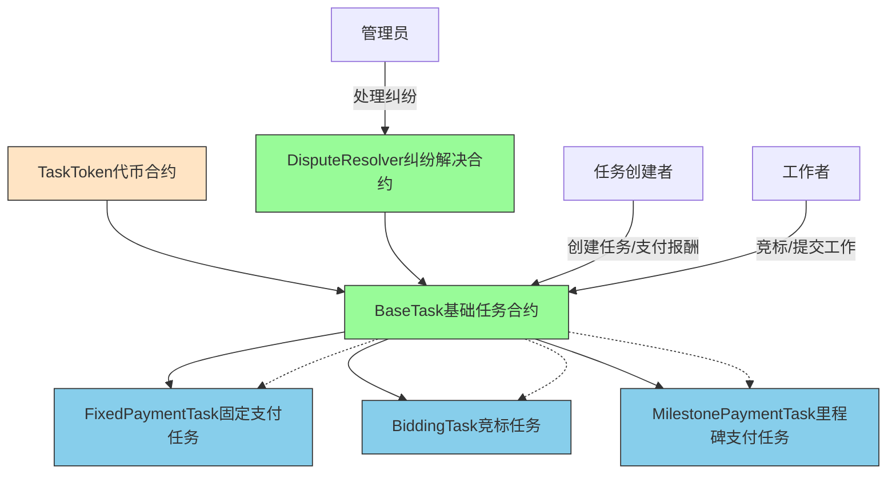
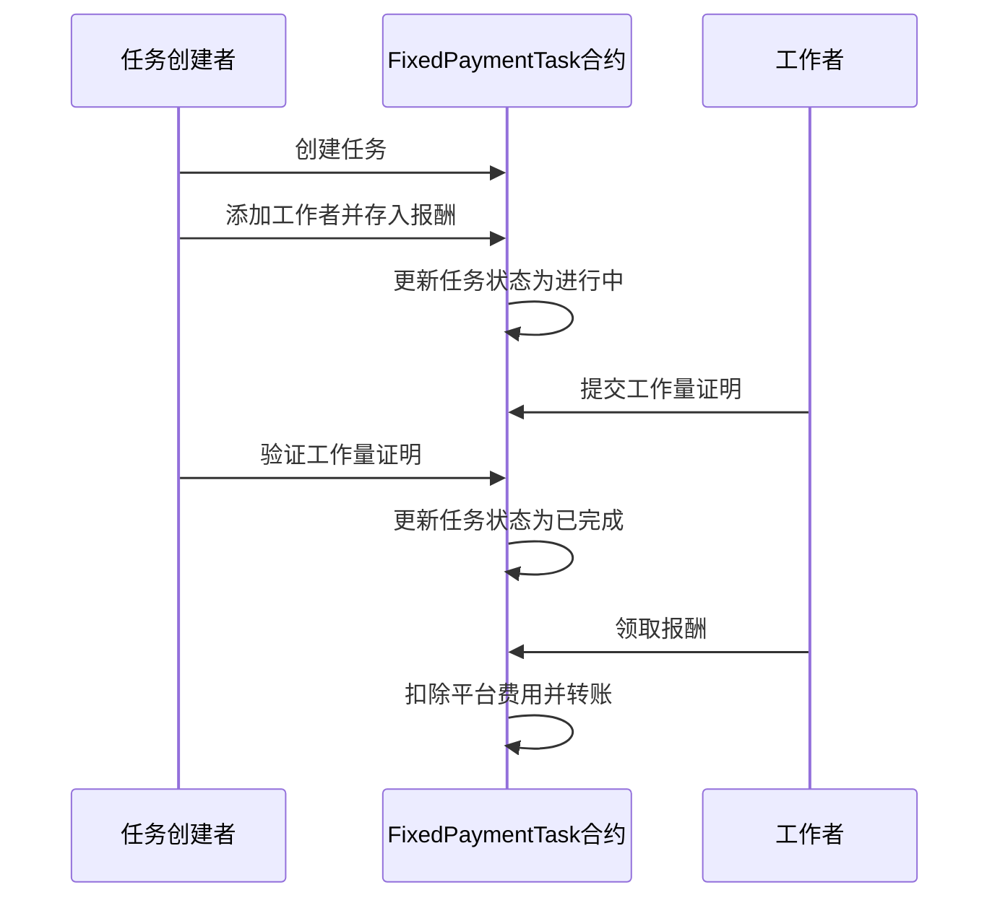
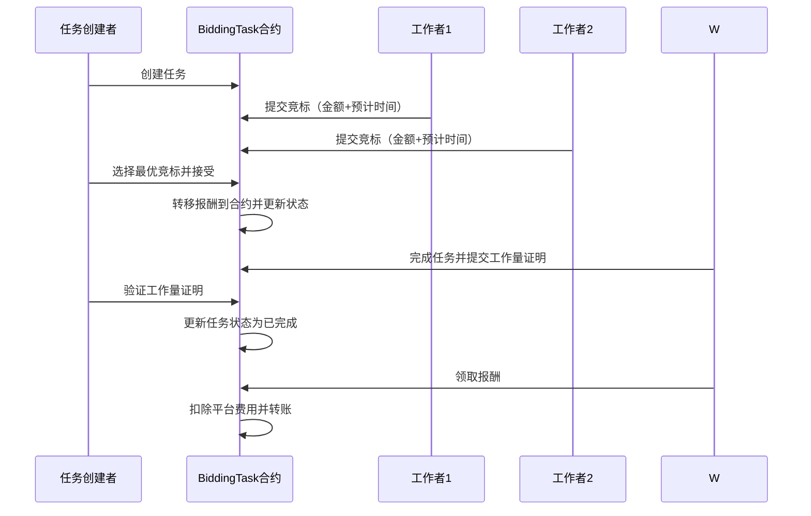
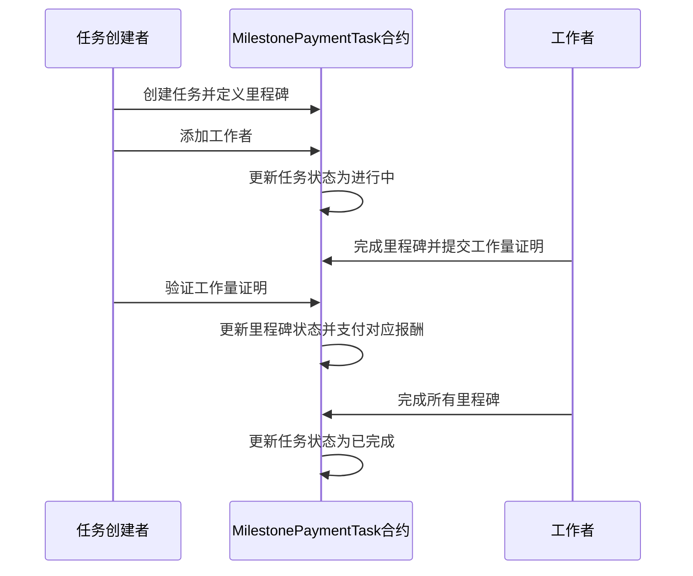
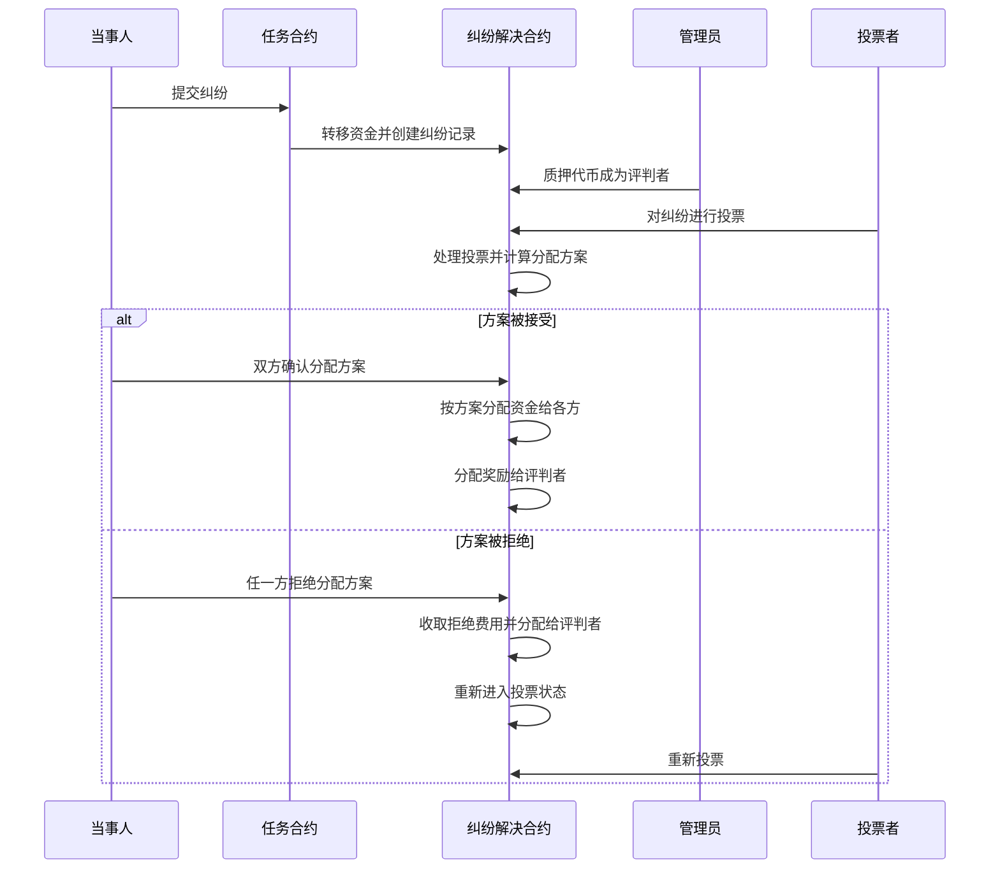

# 众包任务合约系统

## 简介

本项目是一套基于以太坊的智能合约系统，用于管理众包任务。系统支持多种任务类型和支付方式，提供纠纷解决机制，确保任务创建者和工作者之间的公平交易。

本项目基于 Scaffold-ETH 2 构建，是一个开源、最新的工具包，用于在以太坊区块链上构建去中心化应用程序（dapps）。它旨在让开发人员更容易创建和部署智能合约，并构建与这些合约交互的用户界面。

⚙️ 技术栈：NextJS、RainbowKit、Foundry、Wagmi、Viem 和 Typescript

主要功能：

- ✅ 智能合约热重载：前端会随着您编辑智能合约而自动适应
- 🪝 自定义 React hooks：围绕 wagmi 的 React 钩子集合，通过 typescript 自动补全简化与智能合约的交互
- 🧱 Web3 组件库：通用 web3 组件集合，可快速构建您的前端
- 🔥 燃烧钱包和本地水龙头：使用燃烧钱包和本地水龙头快速测试您的应用程序
- 🔐 钱包提供商集成：连接不同的钱包提供商并与以太坊网络交互

## 系统架构

### 架构图



### 核心合约

#### 1. BaseTask.sol - 基础任务合约

这是所有任务类型的基类合约，定义了任务的基本结构和通用功能：

- 任务状态管理（开放、进行中、已完成、已支付、已取消）
- 平台费用管理
- 纠纷解决机制集成
- 抽象方法定义（由子合约实现具体逻辑）

#### 2. TaskToken.sol - 任务代币合约

平台代币合约，基于 ERC20 标准：

- 支持代币铸造和销毁
- 支持授权任务合约使用代币
- 用于任务奖励的支付

#### 3. DisputeResolver.sol - 纠纷解决合约

处理任务创建者和工作者之间的纠纷：

- 纠纷提交和处理流程
- 管理员质押和投票机制
- 资金托管和分配逻辑

### 任务类型合约

#### 1. FixedPaymentTask.sol - 固定支付任务

一次性结清的任务类型，适用于一对一结算场景：

- 任务创建后添加工作者
- 工作者提交工作量证明
- 任务创建者验证工作量证明
- 完成后一次性支付全部报酬

#### 2. BiddingTask.sol - 竞标任务

支持工作者竞标机制的任务类型：

- 工作者可以提交竞标，包含金额和预计完成时间
- 任务创建者可以从竞标者中选择最优报价
- 选定后将报酬转入合约，任务进入进行中状态
- 工作者完成任务后提交工作量证明
- 任务创建者验证工作量证明并支付报酬

#### 3. MilestonePaymentTask.sol - 里程碑支付任务

支持按里程碑支付的任务类型：

- 任务可以分为多个阶段（里程碑）
- 每个里程碑有独立的描述和报酬
- 工作者完成每个里程碑后提交工作量证明
- 任务创建者验证后支付对应里程碑的报酬

## 功能特性

### 1. 任务管理

- 任务创建、编辑、取消
- 工作者分配和移除
- 工作量证明提交和验证
- 任务状态跟踪

### 2. 支付机制

- 平台费用扣除（默认 1%）
- 多种支付方式支持
- 资金安全托管

### 3. 纠纷解决

- 工作者和创建者纠纷提交
- 管理员投票机制
- 公平的资金分配方案

### 4. 安全特性

- 防重入攻击保护
- 合约暂停和恢复功能
- 权限控制（仅任务创建者、工作者等）
- 时间锁机制（防止过早提交纠纷）

## 开发环境要求

开始之前，您需要安装以下工具：

- Node.js (>= v20.18.3)
- Yarn (v1 或 v2+)
- Git

## 快速开始

要开始使用本项目，请按照以下步骤操作：

1. 如果在 CLI 中跳过了依赖安装，请先安装依赖：

```bash
cd my-dapp-example
yarn install
```

2. 在第一个终端中运行本地网络：

```bash
yarn chain
```

该命令使用 Foundry 启动本地以太坊网络。网络在您的本地机器上运行，可用于测试和开发。您可以在 `packages/foundry/foundry.toml` 中自定义网络配置。

3. 在第二个终端中部署测试合约：

```bash
yarn deploy
```

该命令将测试智能合约部署到本地网络。合约位于 `packages/foundry/contracts`，可以根据需要进行修改。`yarn deploy` 命令使用位于 `packages/foundry/script` 中的部署脚本来将合约部署到网络。您也可以自定义部署脚本。

4. 在第三个终端中启动 NextJS 应用：

```bash
yarn start
```

在浏览器中访问您的应用：`http://localhost:3000`。您可以使用 `Debug Contracts` 页面与您的智能合约进行交互。您可以在 `packages/nextjs/scaffold.config.ts` 中调整应用配置。

运行智能合约测试：

```bash
yarn foundry:test
```

- 在 `packages/foundry/contracts` 中编辑您的智能合约
- 在 `packages/nextjs/app/page.tsx` 中编辑您的前端主页。有关 [路由](https://nextjs.org/docs/app/building-your-application/routing/defining-routes) 和配置 [页面/布局](https://nextjs.org/docs/app/building-your-application/routing/pages-and-layouts) 的指导，请查看 Next.js 文档
- 在 `packages/foundry/script` 中编辑您的部署脚本

## 使用流程

### 固定支付任务流程



### 竞标任务流程



### 里程碑支付任务流程



### 纠纷处理流程



## 合约依赖

本系统依赖于 OpenZeppelin 合约库，包括：

- ReentrancyGuard：防重入保护
- Pausable：合约暂停功能
- Ownable：所有权管理
- ERC20：代币标准实现
- SafeERC20：安全的 ERC20 操作

## 部署说明

合约部署需要按以下顺序进行：

1. 部署 TaskToken 合约
2. 部署 DisputeResolver 合约
3. 部署具体任务类型合约（如 FixedPaymentTask、BiddingTask、MilestonePaymentTask）

## 文档

访问我们的[文档](https://docs.scaffoldeth.io)了解如何开始使用 Scaffold-ETH 2 构建应用。

要了解更多功能，请查看我们的[网站](https://scaffoldeth.io)。

## 贡献

我们欢迎对本项目做出贡献！

请查看 [CONTRIBUTING.MD](https://github.com/scaffold-eth/scaffold-eth-2/blob/main/CONTRIBUTING.md) 了解更多信息和贡献指南。
