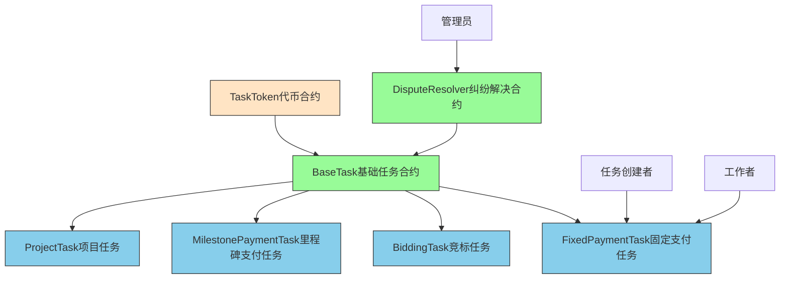
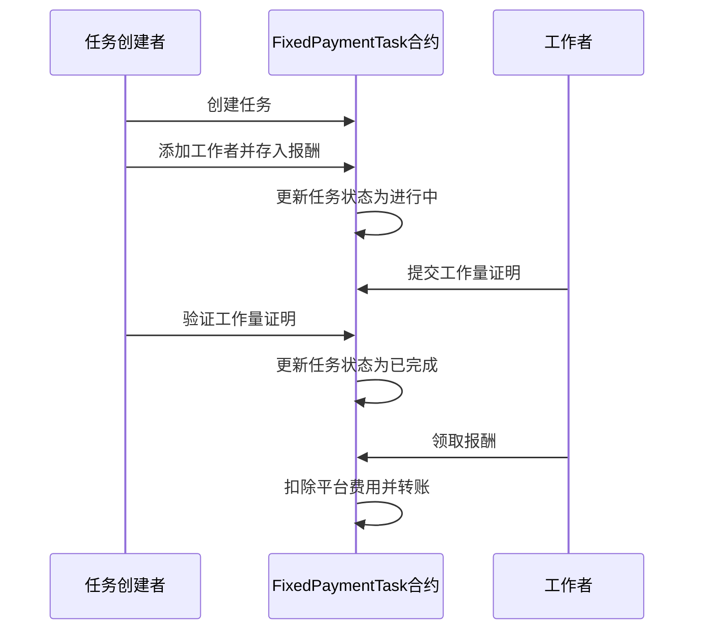
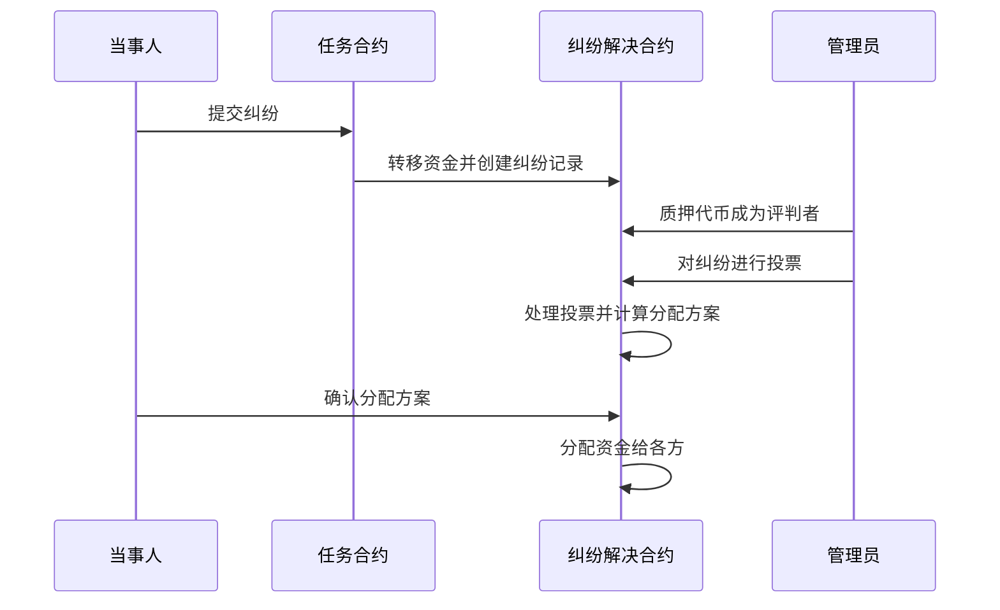

# 众包任务合约系统

## 简介

本项目是一套基于以太坊的智能合约系统，用于管理众包任务。系统支持多种任务类型和支付方式，提供纠纷解决机制，确保任务创建者和工作者之间的公平交易。

## 系统架构

### 架构图

### 核心合约

#### 1. BaseTask.sol - 基础任务合约
这是所有任务类型的基类合约，定义了任务的基本结构和通用功能：
- 任务状态管理（开放、进行中、已完成、已支付、已取消）
- 平台费用管理
- 纠纷解决机制集成
- 抽象方法定义（由子合约实现具体逻辑）

#### 2. TaskToken.sol - 任务代币合约
平台代币合约，基于ERC20标准：
- 支持代币铸造和销毁
- 支持授权任务合约使用代币
- 用于任务奖励的支付

#### 3. DisputeResolver.sol - 纠纷解决合约
处理任务创建者和工作者之间的纠纷：
- 纠纷提交和处理流程
- 管理员质押和投票机制
- 资金托管和分配逻辑

### 任务类型合约

#### 1. FixedPaymentTask.sol - 固定支付任务
一次性结清的任务类型，适用于一对一结算场景：
- 任务创建后添加工作者
- 工作者提交工作量证明
- 任务创建者验证工作量证明
- 完成后一次性支付全部报酬

#### 2. BiddingTask.sol - 竞标任务
支持竞标机制的任务类型（文件较小，可能为占位符）

#### 3. MilestonePaymentTask.sol - 里程碑支付任务
支持按里程碑支付的任务类型（文件较小，可能为占位符）

#### 4. ProjectTask.sol - 项目任务
项目类型任务（文件较小，可能为占位符）

## 功能特性

### 1. 任务管理
- 任务创建、编辑、取消
- 工作者分配和移除
- 工作量证明提交和验证
- 任务状态跟踪

### 2. 支付机制
- 平台费用扣除（默认1%）
- 多种支付方式支持
- 资金安全托管

### 3. 纠纷解决
- 工作者和创建者纠纷提交
- 管理员投票机制
- 公平的资金分配方案

### 4. 安全特性
- 防重入攻击保护
- 合约暂停和恢复功能
- 权限控制（仅任务创建者、工作者等）
- 时间锁机制（防止过早提交纠纷）

## 使用流程

### 固定支付任务流程

### 纠纷处理流程

## 合约依赖

本系统依赖于OpenZeppelin合约库，包括：
- ReentrancyGuard：防重入保护
- Pausable：合约暂停功能
- Ownable：所有权管理
- ERC20：代币标准实现
- SafeERC20：安全的ERC20操作

## 部署说明

合约部署需要按以下顺序进行：
1. 部署TaskToken合约
2. 部署DisputeResolver合约
3. 部署具体任务类型合约（如FixedPaymentTask）